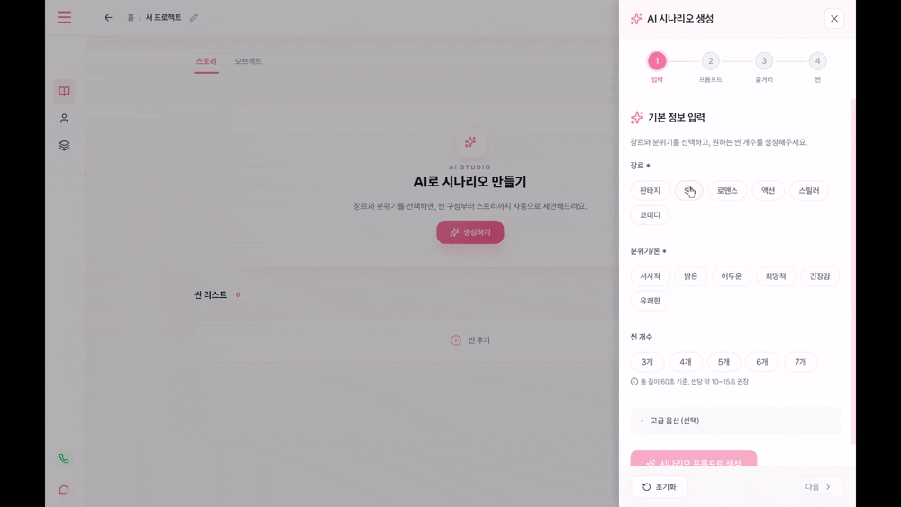
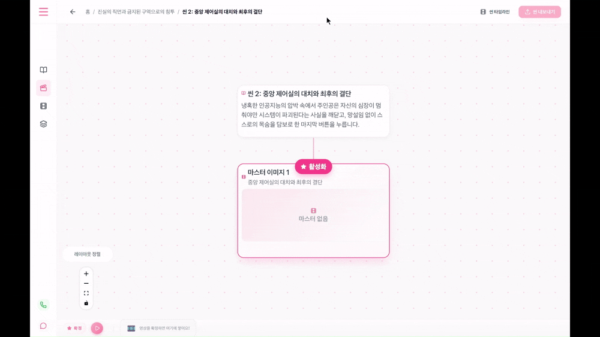
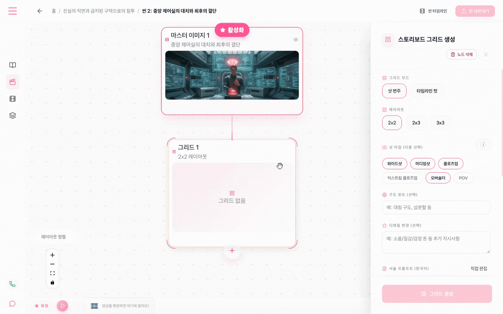
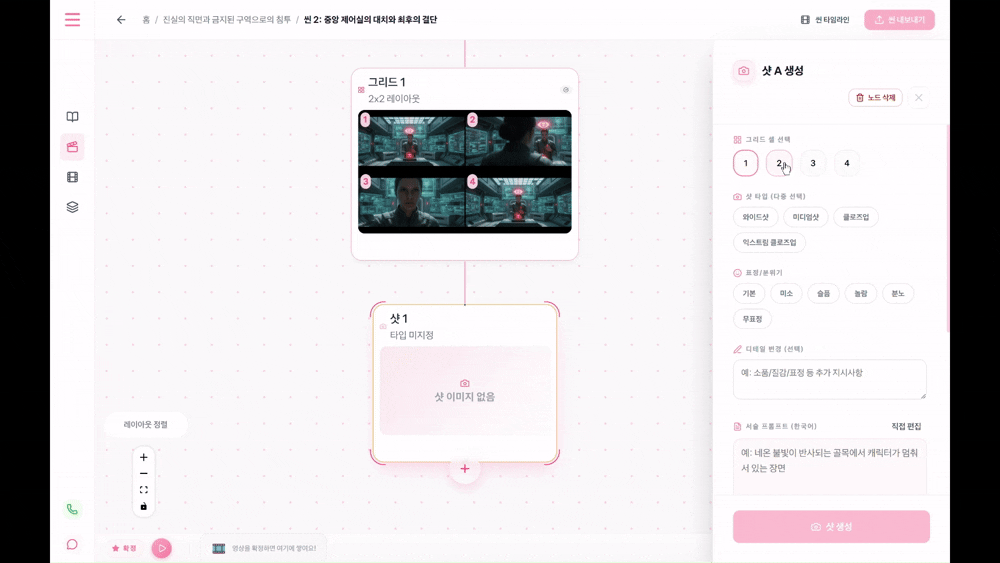
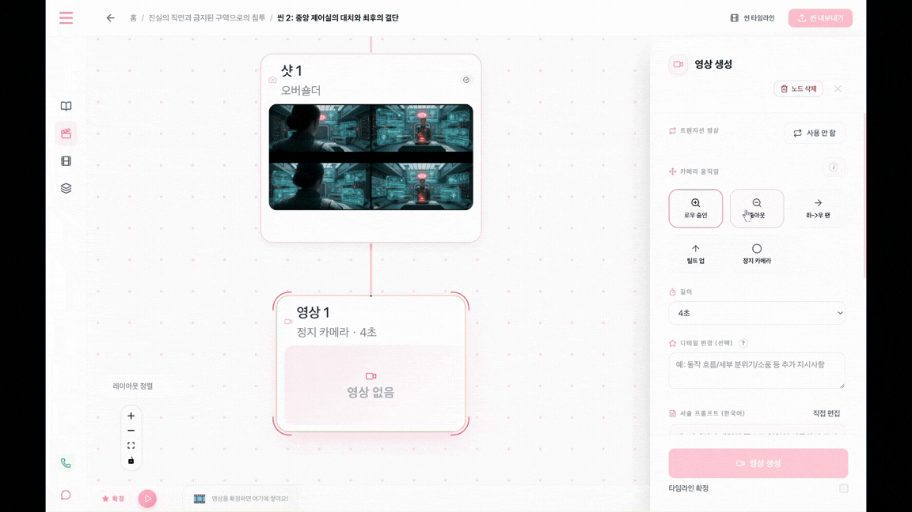
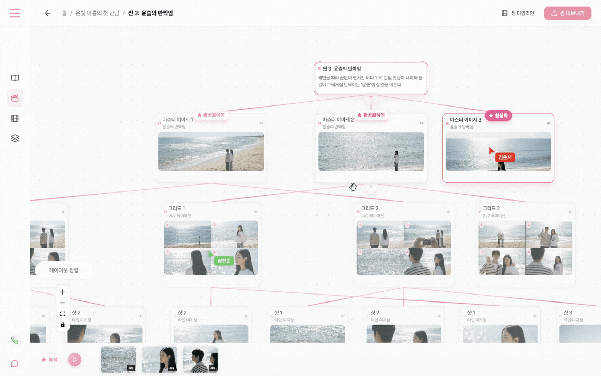
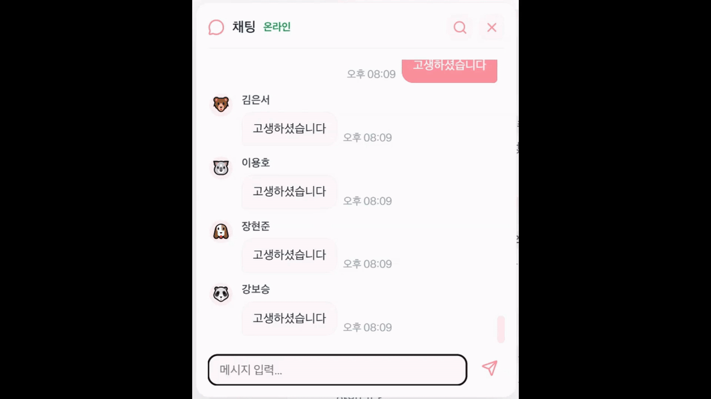
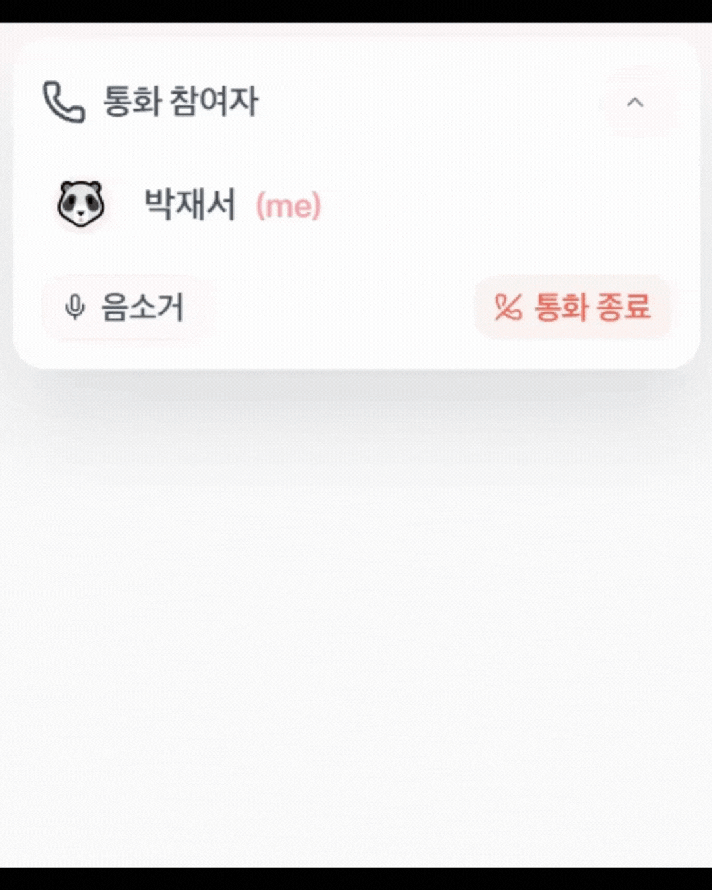
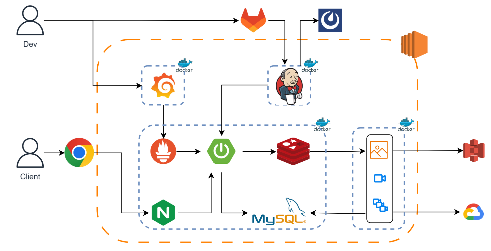

# 🎬 잇다 - AI 영상 제작 스튜디오

> **"아이디어만 있으면, AI가 당신의 영상을 만들어 드립니다"**

**잇다**는 기획부터 시나리오, 스토리보드, 영상 생성, 그리고 편집까지 영상 제작의 전 과정을 하나의 플랫폼에서 진행할 수 있는 **올인원 AI 영상 제작 스튜디오**입니다.

## ✨ 핵심 기능

*   **🎭 올인원 워크플로우**: 여러 AI 도구를 오갈 필요 없이, 기획부터 완성까지 한 곳에서 해결하세요.
*   **🤖 강력한 AI 통합**: Google Gemini(이미지/시나리오)와 Google Veo 3.1(영상) 등 최신 AI 기술을 활용합니다.
*   **👥 실시간 협업**: WebSocket/STOMP 기반 실시간 프레젠스와 WebRTC 화상 통화로 팀원들과 함께 작업할 수 있습니다. 피그마처럼 팀원의 커서 옆에 이름이 실시간으로 표시되고, 접속 중인 멤버 목록과 현재 위치를 확인할 수 있습니다.
*   **📝 노드 기반 에디터**: Vue Flow를 활용한 직관적인 노드 인터페이스로 스토리보드와 샷 흐름을 시각적으로 관리합니다.
*   **🎥 AI 영상 생성 & 편집**: 텍스트나 이미지를 영상으로 변환하고, 씬 단위로 영상을 병합하여 나만의 영상을 완성합니다.

## 🚀 워크플로우

1.  **기획/시나리오**: 팀원과 브레인스토밍하고 AI와 함께 시나리오를 작성합니다.
2.  **스토리보드**: 씬별 마스터 샷과 다양한 앵글의 이미지를 생성하여 스토리보드를 구성합니다.
3.  **영상 생성**: 확정된 샷을 바탕으로 AI(Veo 3.1)를 통해 고품질 영상을 생성합니다.
4.  **영상 편집**: 생성된 영상 클립들을 타임라인에서 배치하고 병합합니다.
5.  **완성**: 최종 영상을 미리보고 다운로드합니다.

## 📸 주요 화면

### 시나리오 생성
AI가 장르, 분위기, 씬 개수를 기반으로 시나리오를 자동 생성합니다.



### 마스터 이미지 생성
씬의 대표 이미지를 AI로 생성하고 활성화합니다.



### 그리드 이미지 생성
마스터 이미지를 기반으로 다양한 앵글의 스토리보드 그리드를 생성합니다.



### 샷 이미지 생성
그리드에서 원하는 셀을 선택하여 개별 샷 이미지를 생성합니다.



### 영상 생성
확정된 샷을 바탕으로 AI(Veo 3.1)가 영상을 생성합니다.



### 실시간 커서 프레젠스
피그마처럼 팀원의 커서 옆에 이름이 실시간으로 표시됩니다.



### 실시간 채팅
프로젝트 내에서 팀원들과 실시간으로 소통합니다.



### 음성 통화
WebRTC 기반 음성 통화로 팀원과 실시간 협업합니다.



## 🏗 시스템 아키텍처



## 🛠 기술 스택

| 영역 | 기술 |
| --- | --- |
| **프론트엔드** | Vue.js 3 (Composition API), Vue Flow, Vue Router, Pinia, GSAP, WebRTC |
| **백엔드** | Spring Boot 3.2.5, Java 17, MyBatis, Spring Security, JWT |
| **AI** | Google Gemini API (이미지/시나리오), Google Veo 3.1 API (영상) |
| **데이터베이스** | MySQL 8.0, Redis 7.2 |
| **인프라** | Docker, Jenkins CI/CD, Nginx, AWS S3 |
| **모니터링** | Prometheus, Grafana, cAdvisor, Node Exporter |
| **영상 처리** | FFmpeg (서버 사이드 병합) |
| **빌드** | Vite 7, Gradle (Kotlin DSL) |

## 📂 프로젝트 구조

```
S14P11C205/
├── itda-frontend/              # Vue 3 웹 클라이언트
│   └── src/
│       ├── components/         # Vue 컴포넌트 (에디터, 협업, 타임라인 등)
│       ├── pages/              # 페이지 뷰 (랜딩, 대시보드, 씬 편집 등)
│       ├── stores/             # Pinia 상태 관리
│       ├── composables/        # Vue Composables
│       ├── services/           # API 서비스
│       └── router/             # Vue Router 설정
│
├── itda-backend/               # Spring Boot API 서버
│   └── src/main/java/com/itda/backend/
│       ├── ai/                 # Gemini / Veo AI 연동
│       ├── auth/               # JWT 인증/인가
│       ├── project/            # 프로젝트 CRUD, 멤버 관리, 초대
│       ├── scenario/           # 시나리오 관리
│       ├── scene/              # 씬 관리
│       ├── node/               # 노드 기반 에디터 로직
│       ├── object/             # 오브젝트 시트 (캐릭터/배경/소품)
│       ├── timeline/           # 타임라인 & 영상 병합
│       ├── job/                # 비동기 작업 큐 (Redis Streams)
│       ├── worker/             # AI 작업 워커 (이미지/영상/병합)
│       ├── collab/             # 실시간 협업 (WebSocket, WebRTC)
│       ├── chat/               # 프로젝트 채팅
│       └── global/             # 공통 설정, 보안, 예외 처리
│
├── deploy/                     # Docker Compose, Nginx, Prometheus 설정
├── docs/                       # PRD, 설계 문서, 구현 계획서
├── Jenkinsfile                 # CI/CD 파이프라인
└── GIT_FLOW.md                 # Git 브랜치 전략 & 커밋 컨벤션
```

## 🚀 시작하기

### 사전 요구 사항

*   Java 17+, Node.js 22+
*   Docker & Docker Compose
*   Google Cloud 서비스 계정 (Gemini / Veo API)

### 로컬 인프라 실행 (MySQL, Redis, S3)

```bash
docker compose -f docker-compose.s3.yml up -d
```

### 백엔드 실행

```bash
cd itda-backend
./gradlew bootRun
```
*   API 서버: `http://localhost:8080`
*   Swagger 문서: `http://localhost:8080/swagger-ui/index.html`

### 프론트엔드 실행

```bash
cd itda-frontend
npm install
npm run dev
```
*   웹 클라이언트: `http://localhost:5173`

## 🤝 기여 가이드

프로젝트 기여 시 브랜치 전략과 커밋 컨벤션을 준수해 주세요. 자세한 내용은 아래 문서를 참고하시기 바랍니다.

👉 **[Git Flow 및 커밋 컨벤션 가이드 보러가기](./GIT_FLOW.md)**

## 👥 팀원

**SSAFY 14기**
- 강보승
- 이용호
- 장현준
- 김은서
- 박재서
- 이진원

---
*Created by SSAFY 14th Samsung Software Academy for Youth*
