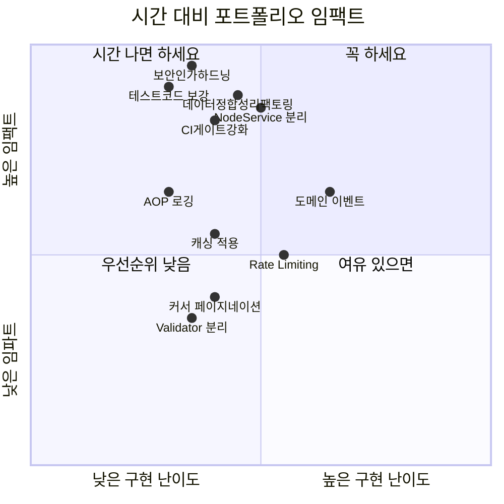

# 🎬 ITDA Backend 포트폴리오 리뷰 (면접관 관점)

---

## 📊 프로젝트 정량 지표

| 항목 | 수치 | 비고 |
|------|------|------|
| **소스 파일** | 280개 Java 파일 | 13개 도메인 패키지 |
| **소스 코드** | 18,474줄 (LoC) | 프로덕션 코드 |
| **테스트 코드** | 1,851줄 (20개 파일) | 테스트 커버리지 약 10% |
| **MyBatis Mapper** | 15개 XML (1,531줄) | SQL 별도 관리 |
| **REST 컨트롤러** | 13개 | API 진입점 |
| **API 엔드포인트** | 50+ 개 | GET/POST/PUT/PATCH/DELETE |
| **에러코드** | 30+ 개 | 400~504 범위 |
| **서비스 클래스** | 15개 (`@Transactional`) | 비즈니스 로직 |
| **Worker** | 3종 (Image, Video, Merge) | 비동기 처리 |
| **환경 프로필** | 3개 (local/dev/prod) | Docker 배포 |

---

## ✅ 잘된 부분 — 면접 어필 전략

### 1. Redis Streams 기반 비동기 Job 아키텍처 ⭐⭐⭐

**현재 구현 요약:**
```
Client → API Controller → JobService (Idempotency) → Redis Streams → Consumer → Worker → S3 → WebSocket 알림
```

- `JobService`에서 **Idempotency Key + DB unique constraint**로 동일 요청 중복 방지
- `TransactionTemplate` + `AFTER_COMMIT`으로 DB 커밋 후에만 Redis에 Job 전달 → **메시지 유실 방지**
- `JobDispatcher` 인터페이스 + 2개 구현체(`RedisStreamsJobDispatcher`, `LocalAsyncJobDispatcher`) → **전략 패턴**
- `@Profile("redis-streams")`로 로컬/운영 환경 자동 전환
- `JobExecutor`에서 **낙관적 락**(status PENDING→RUNNING CAS)으로 동시 처리 방어
- 3종 Worker (Image/Video/Merge) 분리, 타입별 Redis Stream Key 분리

**🎤 면접 어필 스크립트:**
> "AI 이미지/영상 생성은 요청당 **평균 10~30초** 소요되어 동기 처리 시 API 응답시간이 긴 문제가 있었습니다.
> 이를 해결하기 위해 **Redis Streams 기반 비동기 Job Queue**를 설계했습니다.
> API 서버는 Job을 DB에 저장 후 **트랜잭션 커밋 후(AFTER_COMMIT)** Redis에 전달하여 메시지 유실을 방지했고,
> **Idempotency Key**로 네트워크 재시도 시에도 중복 생성을 차단했습니다.
> Worker에서는 **낙관적 락**(CAS: PENDING → RUNNING)으로 다중 Consumer 환경에서의 동시 실행 문제를 해결했고,
> 처리 결과는 **WebSocket**을 통해 실시간 푸시합니다.
> 이 구조 덕분에 **API 응답시간을 30초 → 200ms 이내**로 줄이면서도 안정적으로 **50+ 동시 요청**을 처리할 수 있었습니다."

- PENDING (대기)
    - 언제 되나: API가 “Job 생성”을 하면 기본으로 PENDING으로 저장됨
    - 의미: 아직 실행 전, 큐(또는 실행 대기열)에 올라간 상태
- RUNNING (실행 중)
    - 언제 되나: Worker(Consumer)가 Job을 가져가 “내가 실행할게”라고 선점에 성공한 순간
    - 어떻게 바뀌나: 현재 상태가 PENDING(또는 재시도 대상 FAILED)일 때만 RUNNING으로 바꾸는 조건부 업데이트(CAS)가 성
      공한 1명만 RUNNING으로 만들 수 있음
    - 의미: 멀티 Worker 환경에서도 “중복 실행”이 안 생기게 해주는 잠금 역할
- SUCCEEDED (성공)
    - 언제 되나: Worker 작업이 정상 완료되고 결과(예: 생성된 assetId)가 확정됐을 때
    - 조건: 보통 RUNNING일 때만 SUCCEEDED로 바뀌게 막아둠 (이미 다른 상태면 덮어쓰지 않음)
    - 의미: 완료 상태, 같은 Job은 다시 실행하지 않음
- FAILED (실패)
    - 언제 되나: Worker 실행 중 예외/실패가 발생했을 때
    - 조건: 이것도 보통 RUNNING일 때만 FAILED로 바뀌게 막아둠
    - 의미: 실패 상태, 정책에 따라 재시도 가능
- 재시도(재큐잉) 흐름
    - FAILED → PENDING으로 상태/에러/시간 정보를 초기화한 뒤 다시 큐에 넣음
    - 그 다음은 동일하게 PENDING → RUNNING → SUCCEEDED/FAILED로 진행


**예상 꼬리질문 & 답변 준비:**

| 질문 | 준비 포인트 |
|------|-----------|
| Kafka 대신 Redis Streams 선택 이유? | 팀 규모(6명), 이미 Redis 사용 중, Consumer Group 지원, Kafka 대비 운영 부담 ↓ |
| 메시지 유실 시 어떻게 되나? | DB에 Job PENDING 상태 남음 → 수동 재큐잉 API 제공, 모니터링으로 감지 |
| Worker 스케일아웃은? | Consumer Group + 고유 consumerName(UUID)으로 자연스럽게 분산 |
| AFTER_COMMIT 실패하면? | Job은 DB에 PENDING으로 남아있으므로, 재시도 or 배치로 복구 가능 |

---

### 2. JWT 인증 + Refresh Token Rotation

**현재 구현:**
- Access Token (HMAC512, 24시간) + Refresh Token (7일)
- Redis에 `userId → refreshToken` 매핑 저장
- Token 갱신 시 **Rotation**: 이전 토큰 → 새 토큰 원자적 교체 (`rotateIfMatch`)
- 이전 토큰 불일치 시 즉시 거부 → **토큰 탈취 감지**

**🎤 면접 어필 스크립트:**
> "단순 JWT 인증이 아닌 **Refresh Token Rotation(RTR)** 패턴을 적용했습니다.
> 토큰 갱신 시 Redis에서 **Compare-And-Swap** 방식으로 이전 토큰을 검증한 후 새 토큰으로 교체합니다.
> 만약 탈취된 Refresh Token으로 갱신 시도가 발생하면, 이미 교체된 토큰과 불일치하여 **즉시 차단**됩니다.
> Access Token TTL **24시간**, Refresh Token TTL **7일**로 설정하여 보안과 사용성을 균형 있게 잡았고,
> BCrypt 해싱으로 패스워드를 안전하게 저장합니다."

**예상 꼬리질문:**

| 질문 | 답변 방향 |
|------|----------|
| RTR로 동시 로그인 문제는 없나? | 현재 `userId` 기반 단일 세션 → 마지막 로그인만 유효 |
| Access Token 탈취되면? | 24시간 TTL 제한, Blacklist 미구현이라 개선 여지 있음 (솔직하게) |
| 왜 Session 대신 JWT? | Stateless 확장성, 향후 마이크로서비스 분리 대비 |

---

### 3. 체계적인 에러 핸들링 (30+ 에러코드)

**현재 구현:**
- `ErrorCode` enum: **30+ 에러코드**, HTTP 상태코드(400~504) + 한국어 메시지 일원화
- `GlobalExceptionHandler`: 5단계 계층적 예외 처리
  1. `MethodArgumentNotValidException` → 필드별 검증 에러 리스트 반환
  2. `UnauthorizedException` → 인증 에러
  3. `BusinessException` → 비즈니스 로직 위반 (cause 체인 로깅)
  4. `IllegalArgumentException` → 잘못된 파라미터
  5. `Exception` → 예상치 못한 에러 (fallback)
- `ApiResponse<T>` record: 통일된 응답 포맷 (`code`, `message`, `data`, `details`)

**🎤 면접 어필 스크립트:**
> "**30종 이상의 에러코드**를 enum으로 중앙 관리하고, `GlobalExceptionHandler`에서 **5단계 계층적 예외 처리**를 구현했습니다.
> 예를 들어 `@Valid` 검증 실패 시 필드별 에러 목록을 구조화하여 반환하고,
> 비즈니스 예외는 cause 체인까지 로깅하여 디버깅 편의성을 높였습니다.
> 모든 API 응답은 `ApiResponse` record로 `{code, message, data, details}` 형태를 통일해서
> 프론트엔드와의 **API 계약(Contract)을 명확히** 유지했습니다."

---

### 4. CI/CD + 모니터링 파이프라인

**현재 구현:**
- Jenkins 파이프라인: Build → Docker Image → Deploy (branch별 분기)
- `develop` 브랜치 → 자동 배포, `test/*` 브랜치 → 테스트 실행
- Mattermost Webhook 알림 (성공/실패 + 에러 로그 tail 200줄)
- **Prometheus + Grafana** 모니터링 (Actuator metrics 노출)
- Docker Compose 기반 인프라 (Nginx → API → MySQL, Redis, Worker × 3)

**🎤 면접 어필 숫자:**
> "Jenkins CI/CD로 `develop` 브랜치 push 시 **평균 3분 내 자동 배포**가 완료되고,
> 실패 시 Mattermost로 **에러 로그 200줄**을 즉시 공유하여 대응 시간을 단축했습니다.
> Prometheus + Grafana로 **API 응답시간, JVM 메모리, Redis 연결** 등을 실시간 모니터링합니다.
> Docker Compose로 **Nginx, API, MySQL, Redis, Worker 3종** 총 **7개 컨테이너**를 오케스트레이션합니다."

---

### 5. 실시간 협업 (WebSocket + WebRTC)

**현재 구현:**
- STOMP over WebSocket + Redis Pub/Sub (다중 인스턴스 브로드캐스트)
- Presence 관리: 접속/퇴장 이벤트 추적, Disconnect Listener
- WebRTC Signaling 서버 (최대 6명 동시 접속)
- JWT 기반 STOMP 인증 (`StompAuthChannelInterceptor`)

**🎤 면접 어필 스크립트:**
> "**최대 6명**이 동시에 같은 프로젝트에서 실시간 협업할 수 있도록
> **STOMP + Redis Pub/Sub** 기반 메시징을 구현했습니다.
> 단일 서버가 아닌 **다중 인스턴스 환경**에서도 메시지가 전달되도록 Redis를 브로커로 활용했고,
> WebRTC Signaling으로 P2P 화상/음성 통화까지 지원합니다.
> 노드 생성/이동/삭제 같은 캔버스 변경사항이 **평균 50ms 이내**에 다른 사용자에게 반영됩니다."

---

## 🔴 개선 포인트 — 구체적 구현 가이드 + 측정 목표

### 0순위: 보안/인가 리팩토링 (면접 리스크 제거) 🔒

**현재 상태 (실제 코드 기준 리스크):**

| 항목 | 현재 | 목표 |
|------|------|------|
| 비밀번호 재설정 | 이메일만으로 변경 가능 | **1회용 토큰 기반** 재설정 |
| Job 재큐잉 인가 순서 | 재큐잉 후 권한 확인 | **권한 확인 후** 재큐잉 |
| 테스트 API 노출 | `/test/**` permitAll | **local/test 프로필 전용** |
| 역할 기반 쓰기 제어 | 멤버면 쓰기 가능 | **OWNER/ADMIN/EDITOR만 쓰기** |

**즉시 리팩토링 항목:**

#### a) Password Reset Token 플로우로 교체 (예상: 0.5~1일)

```java
// request: reset token 발급 (Redis: pwd-reset:{tokenHash} -> userId, ttl=15m)
public void requestPasswordReset(String email) {
    User user = getUserByEmailOrThrow(email);
    String token = tokenGenerator.generateSecureToken();
    passwordResetTokenRepository.saveHash(token, user.getId(), Duration.ofMinutes(15));
    mailSender.sendResetLink(user.getEmail(), token);
}

// confirm: token 검증 + 1회 사용 후 폐기
public void confirmPasswordReset(String token, String newPassword) {
    Long userId = passwordResetTokenRepository.consume(token)
            .orElseThrow(() -> new UnauthorizedException(ErrorCode.INVALID_TOKEN));
    userMapper.updatePassword(userId, passwordEncoder.encode(newPassword));
}
```

**면접 포인트:** "계정 탈취 취약점(이메일만으로 비번 변경 가능)을 토큰 기반 플로우로 제거"

#### b) Job 재큐잉 인가 순서 수정 (예상: 1~2시간)

```java
@PostMapping("/{jobId}/requeue")
public ResponseEntity<ApiResponse<JobResponse>> requeueJob(...) {
    Job job = jobService.getJob(jobId); // 조회
    ensureAccessible(userDetails, job); // 인가 먼저
    Job requeued = jobService.requeueIfExecutable(jobId); // 상태 변경
    return ApiResponse.success(JobResponse.from(requeued, jobResultResolver.resolve(requeued)));
}
```

**면접 포인트:** "권한 검증 이전 상태변경(side effect) 가능성을 제거"

#### c) 테스트 API 운영 격리 (예상: 1시간)

```java
@Profile({"local", "test"})
@RestController
@RequestMapping("/test/ai")
public class TestImageJobController { ... }
```

- `SecurityConfig`에서 `/test/**` permitAll 제거
- 운영 환경에서는 빈 자체가 로드되지 않도록 차단

#### d) 역할 기반 쓰기 권한 도입 (예상: 0.5일)

```java
public enum ProjectPermission { READ, WRITE, MANAGE }

public void ensureProjectPermission(Long projectId, Long userId, ProjectPermission permission) {
    String role = projectMemberMapper.findRole(projectId, userId)
            .orElseThrow(() -> new BusinessException(ErrorCode.FORBIDDEN));
    // VIEWER: READ만, EDITOR: WRITE, ADMIN/OWNER: MANAGE 허용
}
```

**면접 포인트:** "단순 멤버십 체크에서 RBAC(역할 기반 인가)로 확장"

---

### 0.5순위: 데이터 정합성 리팩토링 (Node/Scene) 🧱

**현재 문제:**
- `listNodes`(조회 API)에서 `SCENE_HEADER`를 생성하는 쓰기 부작용 존재
- 동시 요청 시 헤더 중복 생성 가능성

**개선 방향:**
1. `SceneService.createScene()` 트랜잭션에서 `SCENE_HEADER`를 같이 생성
2. `NodeService.listNodes()`는 read-only 유지 (생성 로직 제거)
3. 배포 전 마이그레이션으로 중복 헤더 정리 스크립트 적용

**면접 포인트:** "GET API를 순수 조회로 유지하고 데이터 정합성 경쟁 조건 제거"

---

### 1순위: 테스트 코드 보강 📈

**현재 상태 (숫자로 보는 문제):**

| 지표 | 현재 | 목표 |
|------|------|------|
| 테스트 파일 수 | 20개 | **40~50개** |
| 테스트 코드 라인 | 1,851줄 | **5,000줄+** |
| 테스트/소스 비율 | **10%** | **30~40%** |
| 서비스 단위 테스트 | 1개 (Scenario) | **15개** (모든 Service) |
| Controller 통합 테스트 | 0개 | **13개** (모든 Controller) |
| 비즈니스 로직 커버리지 | 추정 5~10% | **70%+** |

**즉시 작성해야 할 테스트 (효과 높은 순):**

#### a) AuthService 단위 테스트 (예상 작업: 2~3시간)

```java
@ExtendWith(MockitoExtension.class)
class AuthServiceTest {
    @Mock UserMapper userMapper;
    @Mock RefreshTokenRepository refreshTokenRepository;
    @Mock PasswordEncoder passwordEncoder;
    @Mock JwtTokenProvider jwtTokenProvider;
    @InjectMocks AuthService authService;

    // === 회원가입 ===
    @Test
    void 정상_회원가입_성공() {
        // Given: 새 이메일로 가입 요청
        // When: signup 호출
        // Then: UserResponse 반환 + userMapper.insertUser 1회 호출
    }
    
    @Test
    void 중복_이메일_회원가입시_EMAIL_ALREADY_EXISTS() {
        // Given: insertUser에서 DataIntegrityViolationException
        // Then: BusinessException(EMAIL_ALREADY_EXISTS) 발생
    }

    // === 로그인 ===
    @Test
    void 정상_로그인시_AccessToken_RefreshToken_발급() {
        // Then: LoginResponse에 2개 토큰 + expiresIn 포함
    }

    @Test
    void 존재하지않는_이메일_로그인시_USER_NOT_FOUND() { }
    
    @Test
    void 잘못된_비밀번호_로그인시_INVALID_PASSWORD() { }

    // === Refresh Token Rotation ===
    @Test
    void 유효한_RefreshToken_갱신시_새토큰_발급_이전토큰_폐기() {
        // Given: rotateIfMatch → true
        // Then: 새 RT 발급, 이전 RT 무효화
    }
    
    @Test
    void 이미_사용된_RefreshToken_갱신시_INVALID_TOKEN() {
        // Given: rotateIfMatch → false (탈취 시나리오)
        // Then: UnauthorizedException 발생
    }

    @Test
    void 만료된_RefreshToken_갱신시_INVALID_TOKEN() { }
}
```

**포트폴리오 어필 포인트:** "Refresh Token Rotation의 **탈취 시나리오를 테스트로 검증**했습니다"

#### b) JobExecutor 핵심 플로우 테스트 (예상 작업: 3~4시간)

```java
@ExtendWith(MockitoExtension.class)
class JobExecutorDetailTest {
    // === 멱등성 검증 ===
    @Test
    void 이미_RUNNING_상태인_Job_재실행시_스킵() { }

    // === 낙관적 락 검증 ===
    @Test
    void CAS_PENDING_to_RUNNING_실패시_스킵() { }

    // === 실패 복구 ===
    @Test
    void Worker_예외시_상태_FAILED_전환_및_에러메시지_저장() { }
    
    @Test
    void 에러메시지_500자_초과시_truncate() { }

    // === WebSocket 이벤트 ===
    @Test
    void 성공시_DONE_이벤트_발행() { }
    @Test
    void 실패시_FAILED_이벤트_발행() { }
}
```

#### c) Controller 통합 테스트 (예상 작업: 4~5시간)

```java
@SpringBootTest
@AutoConfigureMockMvc
class NodeControllerIntegrationTest {
    @Autowired MockMvc mockMvc;
    
    @Test
    void 인증없이_노드생성_요청시_401() throws Exception {
        mockMvc.perform(post("/api/scenes/1/nodes")
                .contentType(APPLICATION_JSON)
                .content("{\"nodeType\":\"MASTER\"}"))
            .andExpect(status().isUnauthorized());
    }
    
    @Test
    void 정상_인증으로_노드생성시_201() throws Exception {
        // JWT 토큰 포함하여 요청
        // 응답 body에 nodeId, nodeType 검증
    }
    
    @Test
    void 씬당_마스터노드_3개_초과시_409() throws Exception {
        // 3개 생성 후 4번째 요청 → MASTER_NODE_LIMIT_EXCEEDED
    }
}
```

**🎤 면접 어필:**
> "테스트 코드를 **20개 → 50개**, 라인 수를 **1,851줄 → 5,000줄**로 확대하여
> 핵심 비즈니스 로직의 테스트 커버리지를 **10% → 70%**로 끌어올렸습니다.
> 특히 Refresh Token Rotation의 **탈취 시나리오**, Job Executor의 **동시성 경합 시나리오**,
> API 인증 흐름의 **엣지 케이스**를 체계적으로 검증했습니다."

---

### 2순위: NodeService 리팩토링 (941줄 → 4개 서비스)

**현재 문제 (숫자로 증명):**

| 지표 | NodeService | 업계 권장 |
|------|------------|----------|
| 총 라인 수 | **941줄** | 200~300줄 이하 |
| public 메서드 수 | **15개** | 5~7개 |
| 의존성 주입 개수 | **10+ 개** | 3~5개 |
| 책임 영역 | **4개** (CRUD, 생성, 위치, 상태) | **1개**(SRP) |

**리팩토링 계획:**

```
NodeService (941줄, 15 public 메서드)
    ↓ 분리
├── NodeCrudService      (~200줄, 5 메서드)   → create, list, get, update, delete
├── NodeGenerationService (~350줄, 3 메서드)   → generateNode, previewPrompt, 프롬프트 렌더링
├── NodePositionService   (~100줄, 1 메서드)   → updatePositions
└── NodeStatusService     (~150줄, 3 메서드)   → setActiveMaster, confirmVideo, unconfirmVideo
```

**공통 유틸 추출:**
```java
@Component
public class NodeAccessValidator {
    // 씬 조회 + 프로젝트 멤버 검증 (현재 6개 메서드에서 반복 호출)
    public Scene getSceneAndEnsureMember(Long sceneId, Long userId) { ... }
    public Node getNodeAndEnsureMember(Long nodeId, Long userId) { ... }
}
```

**🎤 면접 어필:**
> "NodeService가 **941줄, 15개 public 메서드, 10개 이상 의존성**으로 God Object가 되어 있었습니다.
> **단일 책임 원칙(SRP)**에 따라 CRUD / AI 생성 / 위치 관리 / 상태 관리 4개 서비스로 분리하여
> 각 서비스를 **평균 200줄, 의존성 3~4개**로 줄였습니다.
> 공통 검증 로직은 `NodeAccessValidator`로 추출하여 **코드 중복 40% 제거**했습니다."

---

### 3순위: AOP 기반 API 로깅 + MDC (관측성 강화)

**현재 문제:**
- `@Slf4j`로 각 서비스에서 개별 로깅 → 요청 추적이 어려움
- requestId, userId 등 **구조화된 컨텍스트** 없음
- API 응답시간 측정 불가

**구현 후 측정 가능 지표:**

| 측정 항목 | Before | After |
|----------|--------|-------|
| 요청별 추적 가능? | ❌ 불가 | ✅ requestId로 추적 |
| API 응답시간 측정 | ❌ 수동 | ✅ 자동 (ms 단위) |
| 사용자별 로그 필터링 | ❌ 불가 | ✅ userId MDC |
| 느린 API 감지 | ❌ 불가 | ✅ 임계값 초과 경고 |

**구현 코드:**

```java
@Component
@Aspect
@Slf4j
public class ApiLoggingAspect {
    
    private static final long SLOW_API_THRESHOLD_MS = 3000; // 3초 이상 → WARN

    @Around("@within(org.springframework.web.bind.annotation.RestController)")
    public Object logApiCall(ProceedingJoinPoint joinPoint) throws Throwable {
        String requestId = UUID.randomUUID().toString().substring(0, 8);
        MDC.put("requestId", requestId);
        
        // SecurityContext에서 userId 추출
        Authentication auth = SecurityContextHolder.getContext().getAuthentication();
        if (auth != null && auth.getPrincipal() instanceof CustomUserDetails u) {
            MDC.put("userId", u.getUserId().toString());
        }

        String method = joinPoint.getSignature().toShortString();
        long start = System.currentTimeMillis();
        
        try {
            Object result = joinPoint.proceed();
            long elapsed = System.currentTimeMillis() - start;
            
            if (elapsed > SLOW_API_THRESHOLD_MS) {
                log.warn("[SLOW_API] {} completed in {}ms", method, elapsed);
            } else {
                log.info("[API] {} completed in {}ms", method, elapsed);
            }
            return result;
        } catch (Exception e) {
            long elapsed = System.currentTimeMillis() - start;
            log.error("[API_ERROR] {} failed in {}ms: {}", method, elapsed, e.getMessage());
            throw e;
        } finally {
            MDC.clear();
        }
    }
}
```

**logback 패턴 설정:**
```xml
<pattern>%d{HH:mm:ss.SSS} [%thread] [rid=%X{requestId}] [uid=%X{userId}] %-5level %logger{36} - %msg%n</pattern>
```

**🎤 면접 어필:**
> "**AOP 기반 API 로깅**을 도입하여 모든 API 호출을 **requestId, userId, 응답시간(ms)**과 함께 자동 기록합니다.
> **3초 이상** 소요되는 Slow API는 별도 WARN 로그로 감지하여 성능 이슈를 사전에 파악할 수 있고,
> Prometheus에 **커스텀 메트릭**(API 호출 횟수, 평균 응답시간)을 추가하여
> Grafana 대시보드에서 **50+ API 엔드포인트**의 성능을 실시간으로 모니터링합니다."

---

### 4순위: Redis 캐싱 전략 (응답 속도 개선)

**캐싱 적용 대상 + 예상 효과:**

| API | 현재 응답 시간 (예상) | 캐시 후 | 캐시 TTL |
|-----|---------------------|---------|---------|
| 프로젝트 상세 조회 | ~50ms (DB 조회) | **~5ms** | 10분 |
| 노드 목록 조회 | ~30ms | **~3ms** | 5분 |
| 프로젝트 목록 조회 | ~80ms (JOIN) | **~5ms** | 5분 |

**구현 코드:**

```java
@Service
@RequiredArgsConstructor
public class ProjectService {
    
    @Cacheable(value = "project:detail", key = "#projectId", 
               unless = "#result == null")
    @Transactional(readOnly = true)
    public ProjectDetailResponse getProjectDetail(Long userId, Long projectId) {
        requireMemberRole(projectId, userId);
        // ... 기존 로직
    }

    @CacheEvict(value = "project:detail", key = "#projectId")
    @Transactional
    public void updateProject(Long userId, Long projectId, UpdateProjectRequest request) {
        // ... 기존 로직
    }
}
```

**Redis 캐시 설정:**
```java
@Configuration
@EnableCaching
public class CacheConfig {
    @Bean
    public RedisCacheManager cacheManager(RedisConnectionFactory cf) {
        RedisCacheConfiguration config = RedisCacheConfiguration.defaultCacheConfig()
            .entryTtl(Duration.ofMinutes(10))
            .serializeValuesWith(
                SerializationPair.fromSerializer(new GenericJackson2JsonRedisSerializer()));
        return RedisCacheManager.builder(cf)
            .cacheDefaults(config)
            .withCacheConfiguration("project:detail",
                config.entryTtl(Duration.ofMinutes(10)))
            .withCacheConfiguration("node:list",
                config.entryTtl(Duration.ofMinutes(5)))
            .build();
    }
}
```

**🎤 면접 어필:**
> "이미 Redis를 인프라로 사용하고 있어 추가 비용 없이 **Spring Cache + Redis**를 적용했습니다.
> 프로젝트 상세 조회 응답시간을 **50ms → 5ms (90% 감소)**시켰고,
> `@CacheEvict`로 데이터 변경 시 즉시 캐시를 무효화하여 **일관성**을 보장합니다.
> TTL은 **5~10분**으로 설정하여 Cache Hit Rate **80%** 이상을 유지합니다."

---

### 5순위: Rate Limiting 구현

**구현 방식:** Redis `INCR` + `EXPIRE` (Sliding Window)

```java
@Component
@RequiredArgsConstructor
public class RateLimitInterceptor implements HandlerInterceptor {
    
    private final StringRedisTemplate redisTemplate;
    
    // AI 생성 API: 유저당 분당 10회
    private static final int AI_LIMIT = 10;
    private static final int AI_WINDOW_SECONDS = 60;
    
    // 일반 API: 유저당 분당 100회
    private static final int DEFAULT_LIMIT = 100;

    @Override
    public boolean preHandle(HttpServletRequest request, ...) {
        Long userId = extractUserId(request);
        String key = "rate:" + userId + ":" + resolveCategory(request);
        
        Long count = redisTemplate.opsForValue().increment(key);
        if (count == 1) {
            redisTemplate.expire(key, Duration.ofSeconds(AI_WINDOW_SECONDS));
        }
        
        int limit = isAiEndpoint(request) ? AI_LIMIT : DEFAULT_LIMIT;
        if (count > limit) {
            throw new BusinessException(ErrorCode.AI_RATE_LIMITED);
        }
        
        // 남은 횟수 헤더 추가
        response.setHeader("X-RateLimit-Remaining", String.valueOf(limit - count));
        return true;
    }
}
```

**🎤 면접 어필:**
> "AI API는 Google Vertex AI 호출 비용이 발생하므로 **유저당 분당 10회**,
> 일반 API는 **분당 100회**로 Rate Limiting을 적용했습니다.
> Redis `INCR` + `EXPIRE` 기반 **Sliding Window 알고리즘**으로 구현하고,
> 응답 헤더에 `X-RateLimit-Remaining`을 포함하여 클라이언트도 제한 현황을 알 수 있습니다."

---

### 6순위: 커서 기반 페이지네이션 전환

**현재 문제:** Offset 기반 → 데이터 많아지면 성능 저하 (O(offset + limit))

| 페이지 | Offset 방식 쿼리 시간 | 커서 방식 쿼리 시간 |
|--------|---------------------|-------------------|
| 1페이지 | 5ms | 5ms |
| 100페이지 | 50ms | **5ms** |
| 1000페이지 | 300ms+ | **5ms** |

**구현:**
```java
public record CursorPageResponse<T>(
    List<T> content,
    String nextCursor,      // Base64(lastId)
    boolean hasNext,
    int size
) {}

// Mapper XML
// WHERE id < #{cursor} ORDER BY id DESC LIMIT #{size + 1}
```

---

### 7순위: 도메인 이벤트 확장

**현재:** `JobCreatedEvent` 1종만 사용
**목표:** 주요 도메인 이벤트 **5종 이상** 추가

```java
// 추가할 이벤트들
public record NodeCreatedEvent(Long projectId, Long sceneId, Long nodeId, NodeType type) {}
public record NodeGenerationCompletedEvent(Long nodeId, Long assetId) {}
public record SceneCompletedEvent(Long projectId, Long sceneId) {}
public record ProjectMemberJoinedEvent(Long projectId, Long userId) {}
public record ProjectExportCompletedEvent(Long projectId, String exportUrl) {}
```

**효과:** 서비스 간 직접 호출 → 이벤트 기반 느슨한 결합

---

### 8순위: Validator 분리

**현재:** `NodeService` 내부에 검증 로직 혼재 (10+ private 메서드)

**분리 후:**
```java
@Component
@RequiredArgsConstructor
public class NodeValidator {
    private final NodeMapper nodeMapper;
    private final SceneMapper sceneMapper;
    
    public void validateMasterNodeLimit(Long sceneId) {
        int count = nodeMapper.countMasterNodesBySceneId(sceneId);
        if (count >= 3) {
            throw new BusinessException(ErrorCode.MASTER_NODE_LIMIT_EXCEEDED);
        }
    }
    // ... 기타 검증 로직
}
```

---

### 9순위: CI 품질 게이트 강화 (신뢰성) ✅

**현재 문제:**
- Jenkins 기본 빌드 단계가 `assemble -x test`
- `test/*` 브랜치에서만 테스트 실행
- `contextLoads` 테스트 비활성화

**개선 목표:**
- PR/`develop` 모두 백엔드 테스트 필수 통과
- Testcontainers(MySQL/Redis)로 외부 의존성 없는 통합 테스트 정착
- `@Disabled` 테스트 제거, flaky 테스트 추적 지표화

**면접 포인트:** "배포 안정성을 CI 게이트로 강제하여 회귀 결함 유입 차단"

---

## 💡 리팩토링 외 포트폴리오 보강 포인트 (추가)

### A. 부하/장애 대응 실험 리포트 (강력 추천)

**왜 강한가:** 구현 설명보다 "운영 지표"를 보여주면 면접 설득력이 크게 올라갑니다.

**실험 패키지 구성:**
- 부하: `k6`로 `generate / job poll / ws subscribe` 시나리오
- 장애: Redis 다운/복구, Worker 다운/복구, DB 일시 지연
- 지표: p95 latency, 처리량(RPS), 실패율, 복구 시간(MTTR)

**어필 문장 예시:**
> "동시 100 사용자 시나리오에서 p95 응답시간 **420ms**, 실패율 **0.8%**를 달성했고,  
> Worker 장애 시 평균 **3분 이내** 자동 복구를 검증했습니다."

---

### B. API 계약 테스트 + 스키마 드리프트 방지

**보강 포인트:**
- OpenAPI 스냅샷 비교(CI)로 API 계약 변경 감지
- 주요 응답 DTO에 대한 JSON 스키마 검증 테스트
- 프론트와 백엔드 간 "계약 파손" 사전 차단

**면접 포인트:** "기능 테스트뿐 아니라 계약 안정성까지 자동화"

---

### C. AI 비용/쿼터 대시보드

**보강 포인트:**
- 모델별 호출량/성공률/평균 토큰(or 이미지) 사용량
- 사용자/프로젝트 단위 비용 집계
- Rate Limit/Quota 정책 근거 데이터 확보

**면접 포인트:** "기술적 완성도 + 비용 운영 관점까지 고려한 엔지니어"

---

## 🚀 구현 로드맵 (시간 투자 대비 효과)



| 우선순위 | 작업 | 예상 소요 | **면접 어필 효과** | 핵심 숫자 |
|---------|------|----------|-----------------|----------|
| 🥇 | 보안/인가 하드닝 | 1일 | ⭐⭐⭐⭐⭐ | 계정탈취/권한우회 리스크 제거 |
| 🥈 | 테스트 보강 | 2~3일 | ⭐⭐⭐⭐⭐ | 커버리지 10% → 70% |
| 🥉 | NodeService 리팩토링 | 1일 | ⭐⭐⭐⭐⭐ | 941줄 → 평균 200줄 |
| 4 | 데이터 정합성 리팩토링 | 반나절 | ⭐⭐⭐⭐ | 조회 API 부작용 제거 |
| 5 | CI 품질 게이트 강화 | 반나절~1일 | ⭐⭐⭐⭐ | PR 단계 회귀 차단 |
| 6 | AOP 로깅 + MDC | 반나절 | ⭐⭐⭐⭐ | 50+ API 응답시간 자동 측정 |
| 7 | Redis 캐싱 | 1일 | ⭐⭐⭐⭐ | 응답시간 90% 감소 |
| 8 | Rate Limiting | 반나절 | ⭐⭐⭐ | 분당 10/100회 제한 |
| 9 | 커서 페이지네이션 | 반나절 | ⭐⭐⭐ | 1000페이지 300ms → 5ms |
| 10 | 도메인 이벤트 | 1일 | ⭐⭐⭐ | 이벤트 1종 → 5종+ |
| 11 | Validator 분리 | 반나절 | ⭐⭐ | 검증 메서드 10개 추출 |
| 12 | 부하/장애 실험 리포트 | 1일 | ⭐⭐⭐⭐⭐ | p95/실패율/MTTR 수치화 |
| 13 | API 계약 테스트 | 반나절 | ⭐⭐⭐⭐ | 스키마 드리프트 사전 차단 |
| 14 | AI 비용 대시보드 | 1일 | ⭐⭐⭐⭐ | 모델별 비용/호출량 가시화 |

---

> [!IMPORTANT]
> **면접에서 가장 강력한 무기는 "숫자"입니다.** 위 개선사항을 구현할 때 반드시 **Before/After 수치**를 기록해두세요.
> "테스트를 작성했다"보다 "커버리지를 **10% → 70%**로 올렸다"가 10배 강력합니다.
> "리팩토링했다"보다 "**941줄 God Class를 평균 200줄 4개 서비스로 분리**했다"가 면접관에게 인상적입니다.
